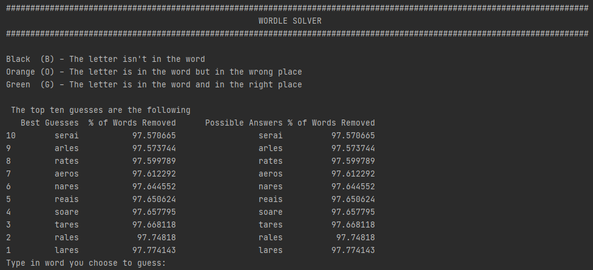
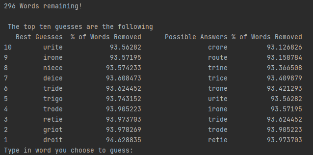

# Wordle Solver

**Version 1.0**
 

---
### Description

---

This solver provides you with the most **optimal** guess at any stage of the game, to help you solve the daily wordle in as few guesses as possible! 

---
### How it Works 

---
This Solver works by:
- **Filtering** out five-letter words that cannot be the answer based on previous results (i.e. combinations of greens, 
  oranges and blacks).
- **Ranking** each five-letter word based on how many words they are expected to filter out if used as a guess. 

  
Finding the expected number of words filtered out from a guess involves:

* For each possible combination of greens, oranges and blacks.  
  * The number of words filtered out given that combination was the result.
  * The likelihood of that combination occurring.
* Using weighted a weight mean to find the expected number of words filtered out.
   

&nbsp;

🥇So what is the most optimal first guess? This program says **LARES** 🥇

🤖 However, **LARES** is probably more useful for the program rather than a human 🤖

---
### Screenshots

---
Starting Screen:

&nbsp;

&nbsp;

A guess has been inputted. The program has filtered out words and now shows the new best guesses:

&nbsp;

&nbsp;

---
###  To do

---
* [ ] Improve the UI

* [ ] Incorporate the frequency of word usage in the english language when finding the most optimal word

---
### License & copyright  

---

© 2022 Peter Booth